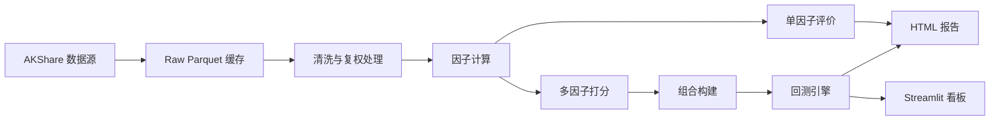

# A 股多因子量化工程包实施计划

## 工程结构
- 创建标准 Python 包结构：[`pyproject.toml`](pyproject.toml)、[`README.md`](README.md)、[`configs/default.yaml`](configs/default.yaml)、[`src/ashare_quant/`](src/ashare_quant/)、[`tests/`](tests/)、[`examples/`](examples/)。
- 使用 `src` 布局，包名暂定 `ashare_quant`，提供 CLI 入口 `ashareq`，支持 `fetch-data`、`run-factor`、`run-backtest`、`make-report`、`run-dashboard`。
- 依赖建议：`akshare`、`pandas`、`numpy`、`scipy`、`statsmodels`、`scikit-learn`、`pyyaml`、`typer`、`plotly`、`matplotlib`、`seaborn`、`streamlit`、`jinja2`、`pyarrow`、`loguru`。

## 数据层与清洗
- 在 [`src/ashare_quant/data/`](src/ashare_quant/data/) 实现 AKShare 适配器、缓存层和统一数据模型。
- 支持日行情、复权行情、指数成分、行业分类、基本面指标、估值指标、财务质量指标等数据读取。
- 默认本地缓存到 [`data/raw/`](data/raw/) 与 [`data/processed/`](data/processed/)，优先使用 Parquet，避免重复请求 AKShare。
- 实现缺失值处理、极端值 winsorize、截面 z-score 标准化、停牌过滤、涨跌停不可交易样本过滤、行业/市值暴露数据对齐。

## 因子研究框架
- 在 [`src/ashare_quant/factors/`](src/ashare_quant/factors/) 提供常见因子：动量、反转、波动率、流动性、换手、估值、成长、盈利、杠杆、质量。
- 在 [`src/ashare_quant/analysis/`](src/ashare_quant/analysis/) 实现单因子分层回测、IC、RankIC、IR、IC 衰减、换手率、行业/市值中性化、因子相关性矩阵。
- 多因子模型支持等权、IC 加权、IR 加权、风险平价、相关性约束筛选，并输出综合打分。

## 组合构建与回测
- 在 [`src/ashare_quant/backtest/`](src/ashare_quant/backtest/) 实现调仓日生成、股票池过滤、打分排序、持仓上限、行业约束、手续费、滑点、买卖限制和净值曲线。
- 支持按周、月、季调仓，提供滚动窗口回测和参数敏感性检验。
- 输出年化收益、年化波动、夏普比率、最大回撤、Calmar、胜率、月度收益、换手、交易成本、行业暴露、持仓明细。

## 可视化与报告
- 在 [`src/ashare_quant/visualization/`](src/ashare_quant/visualization/) 使用 Plotly/Matplotlib 生成所有核心结果图：净值曲线、回撤、月度收益热力图、IC 序列、IC 分布、分层收益、因子相关性、换手率、风险暴露、参数敏感性热力图。
- 在 [`src/ashare_quant/reporting/`](src/ashare_quant/reporting/) 生成 HTML 研究报告，汇总因子表现、组合表现、风险暴露和稳健性检验。
- 在 [`src/ashare_quant/dashboard/`](src/ashare_quant/dashboard/) 创建 Streamlit 看板，支持选择因子、时间区间、调仓频率、股票池和组合方法，交互展示图表与指标。

## 数据流

## 验证策略
- 为核心纯函数添加单元测试：收益计算、winsorize、标准化、中性化、IC、回撤、绩效指标、调仓逻辑。
- 提供一个 `examples/quickstart.py`，默认用小股票池和较短日期跑通完整流程，便于验证 AKShare 接口、缓存、回测和可视化输出。
- 首版完成后运行测试与一次 quickstart 流程；若 AKShare 网络或接口限流不可用，会保留离线缓存/样例数据路径并在 README 中说明。